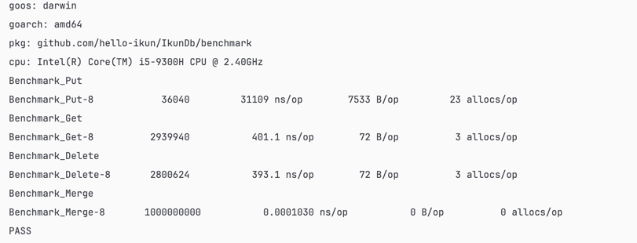
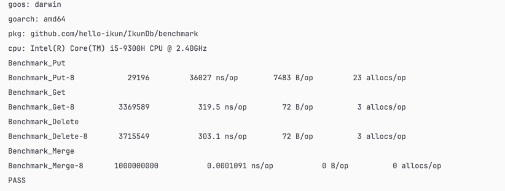
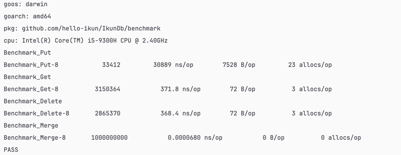
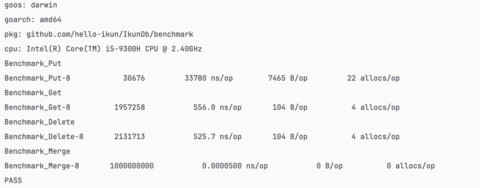

   [](https://pkg.go.dev/github.com/hello-ikun/IkunDb)   

**IkunDB** 是我个人练习的成果，历时 2.5 周精心打磨而成的小型产品。尽管其参考价值有限，但却充满了戏剧性的。小说写多了，第一次写这玩意，突然就不会了哈哈哈。

## 👋 厉不厉害你 Kun哥?

1. **IkunDB** 是我个人练习的成果，历时 2.5 周精心打磨而成的小型产品。尽管其参考价值有限，但却充满了戏剧性的
2. **IkunDB** 是建立在高效的 Bitcask 模型之上的高性能键值（KV）存储引擎，为用户提供了快速可靠的数据检索和存储功能。
3. **IkunDB** 确保了高效的读写操作，从而提高了整体性能。它提供了一种简化的方法来存储和访问键值对，总之很简单，我上我也行。
4. **IkunDB** 快就完事了。
5. **IkunDB** merge 方法直接使用纯纯的暴力大法，但不失是一种高效之法。

## 🚀 听说你也想想用 IkunDb?

### 使用Golang SDK

下面是一个如何使用`Unix`/`Linux`版本的简单示例:
```go
func main() {
	db := engine.NewDb()

	for i := 0; i < 8000; i++ {
		err := db.Put(utils.GetTestkey(i), utils.GetTestValue())
		if err != nil {
			fmt.Println(err)
		}
	}
	for i := 0; i < 8000; i++ {
		key := utils.GetTestkey(i)
		val, err := db.Get(key)
		fmt.Println("key: ", string(key), "value", string(val))
		if err != nil {
			return
		}
		if i > 2000 {
			err = db.Delete(key)
			if err != nil {
				return
			}
		}
	}
	err := db.Merge()
	if err != nil {
		return
	}
	_ = db.Close()
}
```
### Windows版本的呀 坤坤我呀，好烦(。•ˇ‸ˇ•。)
>过几天处理一下细节

## 🚀 关于IkunDb厉不厉害问题的真回答
>说实话 我挑好的放
### OrderMap

### ART

### Map 
>go语言自带的 map 结构


### Btree

## 👋Ikun 计划！
- [ ] 更加极致的内存开销，实现高并发
- [ ] 实现分布式存储，raft 协议学习 ing
- [ ] 兼容Redis协议和命令。目前已经实现了，但没有提交
- [x] 支持http服务。
- [x] 支持tcp服务。
- [x] 日志管理
- [ ] 数据处理
## 注意
- [x] 精力有限，可能存在部分残余问题。后期会不断完善代码逻辑
## 参考来源！
>bitcask论文
- [Rose大佬](https://github.com/rosedblabs/rosedb)
- [flyDb](https://github.com/ByteStorage/flydb)
